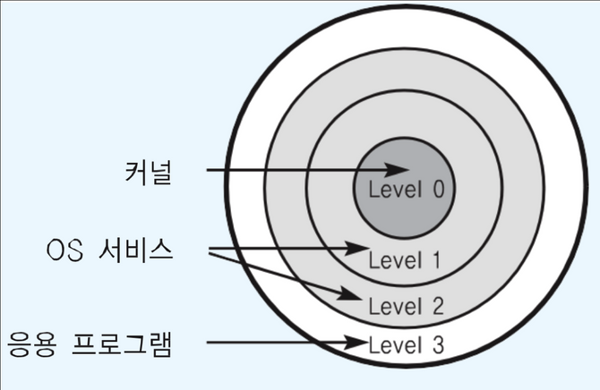

### CPU Protection Rings

- CPU도 권한 모드라는 것을 가지고 있다.

  - 사용자 모드: user mode by application, Level 3
  - 커널 모드: kernel mode by OS 특권 명령어 실행과 원하는 작업 수행을 위한 자원 접근을 가능케 하는 모드, Level 0

    > kernel은 알맹이, shell은 껍데기를 의미한다.

  - 레벨1, 2(OS 서비스)도 있긴 한데 몰라도 된다.
  - 이러한 접근 권한이 구분됨에 따라, 우리가 실행하는 응용 프로그램은 그 명령에 따라 **어떤 명령은 사용자 모드, 어떤 명령은 시스템 콜을 통해 커널 모드에서 실행된다.**

  

  ### 시스템 콜은 커널 모드로 실행

  - 커널 모드에서만 실행 가능한 기능들이 있다.
  - 커널 모드로 실행하려면, **반드시 시스템 콜**을 거쳐야 한다. (즉 응용프로그램은 직접 CPU를 실행시킬 순 없다.)
  - 시스템 콜은 운영체제가 제공한다.

  ### 사용자 모드와 커널 모드

  - 이 구분으로 인해 함부로 응용 프로그램이 전체 컴퓨터 시스템을 해하지 못한다.
  - 이를테면, 주민등록동본은 꼭 동사무소나 정부 사이트를 통해 신청서를 써야 발급받을 수 있는 것과 같은 이치

  ### 코드 예제

  ```c
  // 1. 사용자 모드에서 실행
  #include <unistd.h>
  #include <sys/types.h>
  #include <sys/stat.h>
  #include <fcntil.h>

  int main() {
  	int fd;
  	fd = open("data.txt", O_RDONLY); // 2. open() 시스템 콜 호출
  	if(fd == -1) { // 7. open() 함수 이후의 프로그램을 계속해서 실행
  		printf("Error: can not open file\n");
  		return 1;
  	} else {
  		printf("File opened and now close\n");
  		close(fd);
  		return ();
  	}
  }
  ```

  1. 사용자 모드에서 실행
  2. `open()` 시스템 콜 호출
  3. **커널 모드로 전환**
  4. `open()` 함수를 처리하는 `sys_open()` 커널 함수 호출
  5. 파일 열기의 low level 연산 수행
  6. 사용자 모드로 전환
  7. `open()` 함수 이후의 프로그램을 계속해서 실행

  ### 정리

  - 운영체제는 **시스템 콜** 제공
  - 프로그래밍 언어별로 운영체제 기능을 활용하기 위해, 시스템 콜을 기반으로 **API** 제공
  - 응용 프로그램은 운영체제 기능 필요시, 해당 API를 사용해서 프로그램을 작성
  - 응용 프로그램이 실행돼서, 운영체제 기능이 필요한 API를 호출하면, 시스템 콜이 호출돼서, **커널 모드로 변경**되어 OS 내부에서 해당 명령이 실행되고, **다시 응용 프로그램으로** 돌아간다.
