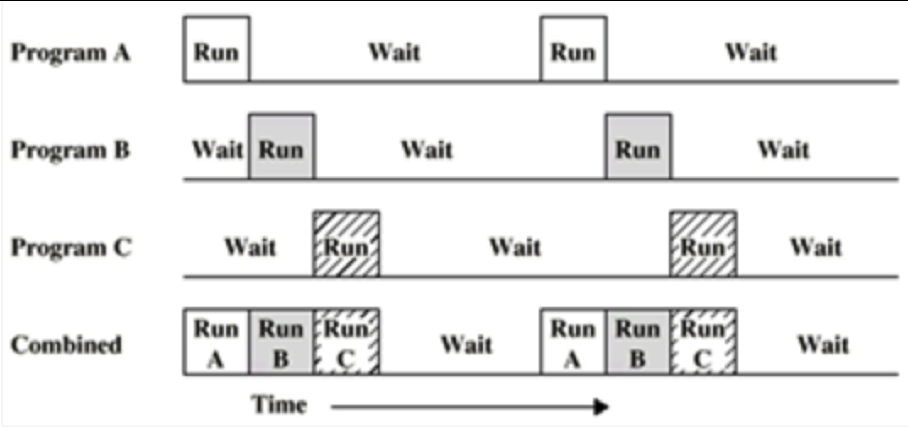
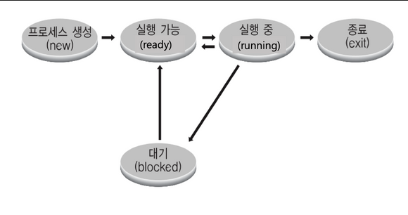
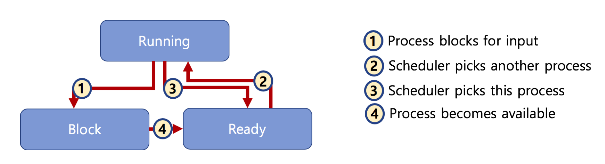

## 프로세스 상태와 스케쥴링

### 멀티 프로그래밍과 Wait

- 멀티 프로그래밍: CPU 활용도를 극대화하는 스케쥴링 알고리즘
- Wait: 간단히 저장매체로부터 파일 읽기를 기다리는 시간으로 가정

Combined되는 것이 CPU 활용도가 극대화된다. 어떻게 해야 이렇게 될까?

### 프로세스 상태

- running state: 현재 CPU에서 실행중인 상태
- ready state: CPU에서 실행 가능 상태(대기 상태)
- block state: 특정 이벤트 발생 대기 상태

### 프로세스 상태 간의 관계

기본적으론 큐를 이용하여 프로세스를 CPU 위에 올린다.

- Ready State Queue
- Running State Queue
- Block State Queue
