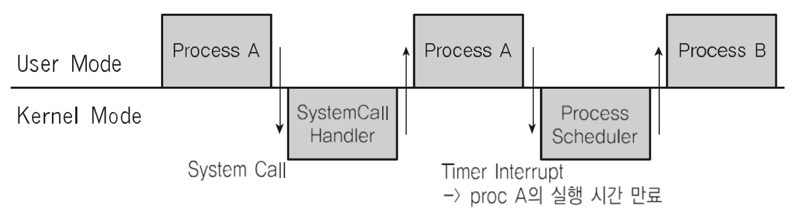

## 인터럽트

CPU가 프로그램을 실행하고 있을 때, 입출력 하드웨어 등의 장치나 또는 예외상황이 발생하여 처리가 필요할 경웨 CPU에 알려서 처리하는 기술

> 어느 한 순간에 CPU가 실행하는 명령은 하나다. 다른 장치와 어떻게 소통할까?

### 인터럽트가 필요한 이유

- 선점형 스케쥴러 구현
  - 프로세스 running 중에 스케쥴러가 이를 중단시키고, 다른 프로세스로 교체하기 위해, 현재 프로세스 실행을 중단시킨다.
    - 그러기 위해선 스케쥴러가 코드가 실행이 돼서, 현 프로세스 실행을 중지시켜야 한다.
- I/O 기기와의 커뮤니케이션
  - 저장매체에서 데이터 처리 완료시, 프로세스를 깨워야 한다. (block → ready)
- 예외 상황 핸들링
  - CPU가 프로그램을 실행하고 있을 때, 입출력 하드웨어 등의 장치나 또는 예외상황이 발생한 경우, CPU가 해당 처리를 할 수 있도록 CPU에 알려줘야 한다.

### 인터럽트 처리 예시

- CPU가 프로그램을 실행하고 있을 때,
  - 입출력 하드웨어 등의 장치 이슈 발생
    - 파일 처리가 끝났다는 것을 운영체제에 알려주기
    - 운영체제는 해당 프로세스를 block state에서 ready state로 프로세스 상태 변경하기
  - 예외 상황이 발생
    - 0으로 나누는 계산이 발생해서, 예외 발생을 운영체제에 알려주기
    - 운영체제가 해당 프로세스 실행 중지/에러 표시

### 이벤트와 인터럽트

- 인터럽트는 일종의 이벤트로 불린다.
- 이벤트에 맞게 운영체제가 처리한다.

### 주요 인터럽트

1. 계산하는 코드에서 0으로 나누는 코드 실행
2. 타이머 인터럽트(선점형 스케쥴러를 위해 필요)
3. 입출력 인터럽트(프린터, 키보드, 마우스, 저장매체 등)

### 인터럽트 종류

- 내부 인터럽트(소프트웨어 인터럽트)
  - 주로 프로그램 내부에서 잘못된 명령이나 데이터 사용시 발생
    - 0으로 나눴을 때
    - 사용자 모드에서 허용되지 않는 명령 또는 공간 접근할 때
    - 계산 결과가 Overflow, Underflow날 때
- 외부 인터럽트(하드웨어 인터럽트)
  - 주로 하드웨어에서 발생되는 이벤트(프로그램 외부)
    - 전원 이상
    - 기계 문제
    - 입출력 관련 이벤트
    - 타이머 이벤트

### 시스템 콜 인터럽트

- 시스템 콜 실행을 위해서는 강제로 코드에 인터럽트 명령을 넣어, CPU에게 실행시켜야 한다.
- 시스템 콜 실제 코드
  - eax 레지스터에 시스템 콜 번호를 넣고,
  - ebx 레지스터에는 시스템 콜에 해당하는 인자값을 넣고,
  - 소프트웨어 인터럽트 명령을 호출하면서 0x80 값을 넘겨준다. (소프트웨어 인터럽트 명령)
    - CPU는 사용자 모드를 커널 모드로 바꿔준다.
    - eax로부터 시스템 콜 번호를 찾아 해당 번호에 맞는 시스템 콜 함수로 이동
    - 해당 함수 실행 후, 다시 커널 모드에서 사용자 모드로 변경하고, 다시 해당 프로세스 다음 코드를 진행한다.

### 사용자/커널 모드와 프로세스, 인터럽트

### 인터럽트와 IDT

- 인터럽트는 미리 정의되어 각각 번호와 실행 코드를 가리키는 주소가 기록되어 있다.
  - IDT(Interrupt Descriptor Table)에 기록되어 있다.
  - 컴퓨터가 부팅할 때 운영체제가 기록한다.
  - 운영체제 내부 코드(커널 영역)
- 예를 들어 리눅스는,
  - 0 ~31은 예외상황 인터럽트
  - 32 ~ 47은 하드웨어 인터럽트
  - 128은 시스템 콜

### 인터럽트와 프로세스

1. 프로세스 실행 중 인터럽트 발생
2. 현 프로세스 실행 중단
3. 인터럽트 처리 함수 실행(운영체제)
4. 현 프로세스 재실행
