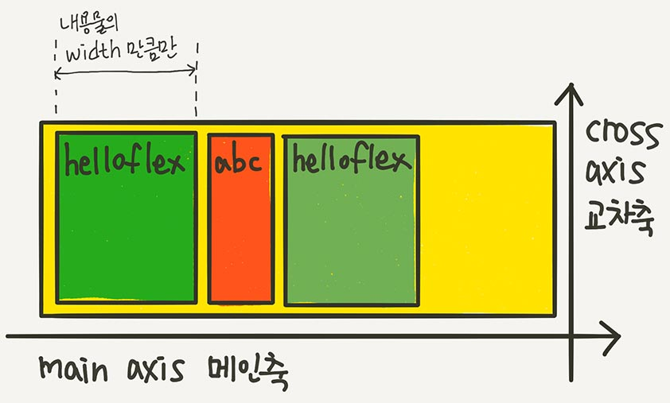
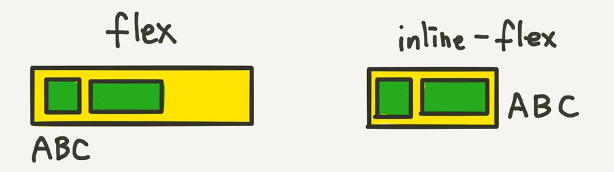
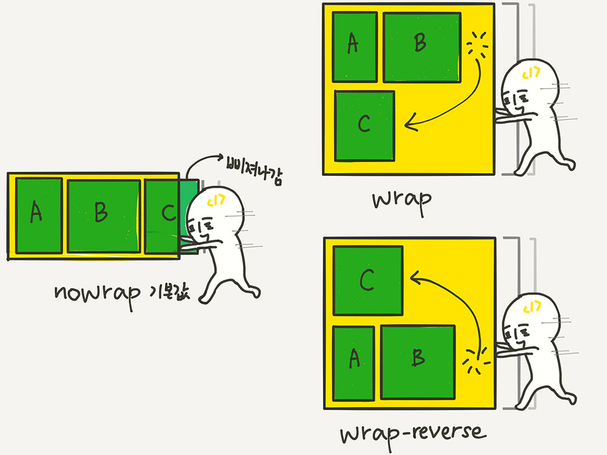
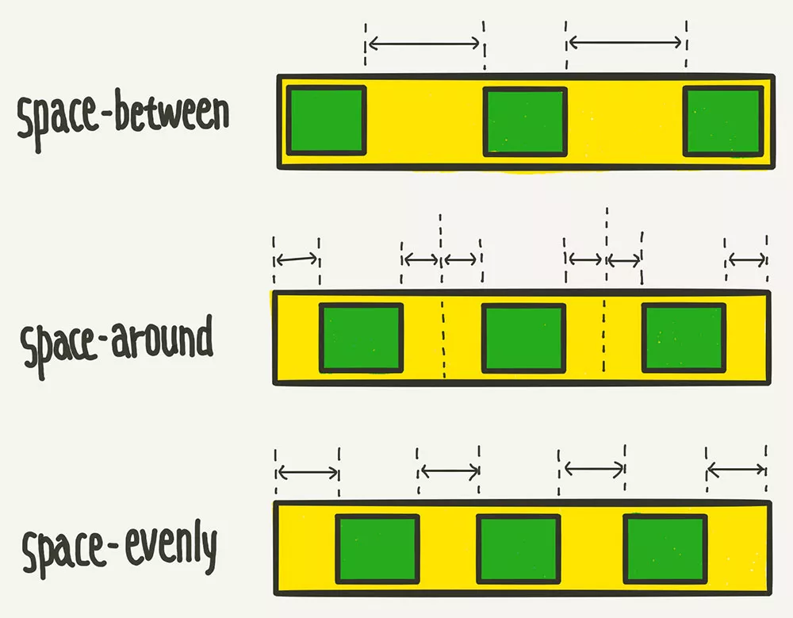
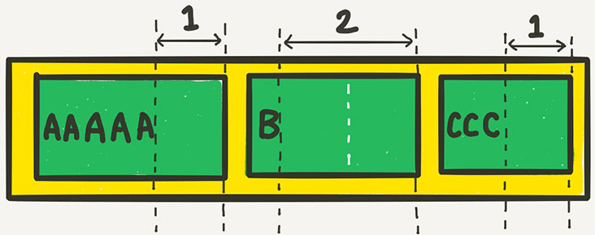

## 개요

Flex 레이아웃을 만들기 위한 기본적인 HTML 구조는 다음과 같다.

```html
<div class="container">
  <div class="item">helloflex</div>
  <div class="item">abc</div>
  <div class="item">helloflex</div>
</div>
```

부모 요소인 `div.container`를 `Flex Container`(플렉스 컨테이너)라고 부르고,자식 요소인 `div.item`들을 `Flex Item`(플렉스 아이템)이라고 부른다.

Flex의 영향을 받는 전체 공간이 **컨테이너**, 설정된 속성에 따라 어떠한 형태로 배치되는 것들이 **아이템**이라고 생각하면 된다.

Flex의 속성들은,

- 컨테이너에 적용하는 속성
- 아이템에 적용하는 속성으로 나뉜다.

## 컨테이너의 속성들

### `display: flex;`

Flex 컨테이너에 `display: flex;`를 적용하는게 시작이다. 이것만으로 아이템들은 기본적으로 아래 그림과 같이 배치된다.

```css
.container {
  display: flex;
  /* display: inline-flex; */
}
```



Flex 아이템들은 가로 방향으로 배치되고, `inline` 요소처럼 자신이 가진 내용물의 `width`만큼만 차지하게 된다. `height`는 컨테이너의 높이만큼 늘어난다.

아이템들이 배치된 방향의 축을 **메인축**(Main Axis), 메인축과 수직인 축을 **수직축 또는 교차축**(Cross Axis)이라고 부른다.

`inline-flex`도 있는데, 이건 block과 inline-block의 관계를 생각하면 이해하기 편하다. 아이템의 배치와 관련이 있다기 보다는, 컨테이너가 주변 요소들과 어떻게 어우러질지 결정하는 값이다. `inline-flex`는 `inline-block`처럼 동작한다.



### `flex-direction`

아이템들이 배치되는 축의 방향(가로 혹은 세로)을 결정하는 속성이다.

```css
.container {
  flex-direction: row; /* 행(가로) 방향 */
  flex-direction: column; /* 열(세로) 방향 */
  flex-direction: row-reverse;
  flex-direction: column-reverse;
}
```


### **`flex-wrap`**

컨테이너가 더 이상 아이템들을 한 줄에 담을 여유 공간이 없을 때 아이템 줄바꿈을 어떻게 할지 결정하는 속성이다.

```css
.container {
  flex-wrap: nowrap; /* 기본값, 줄바꿈을 하지 않는다. 넘치면 그냥 삐져 나간다. */
  flex-wrap: wrap; /* 줄바꿈을 한다. float, inline-block으로 배치한 요소들과 유사 */
  flex-wrap: wrap-reverse; /* 줄바꿈을 하는데, 아이템을 역순으로 배치한다. */
}
```



### `**flex-flow**`

`flex-direction`과 `flex-wrap`을 한번에 지정할 수 있는 단축 속성이다.

```css
.container {
  flex-flow: row wrap;
  /* 아래의 두 줄을 줄여 쓴 것 */
  /* flex-direction: row; */
  /* flex-wrap: wrap; */
}
```

### `justify-content`

- `flex-start`: 아이템들을 컨테이너의 시작점으로 정렬
  - `flex-direction: row` → 왼쪽 정렬
  - `flex-direction: column` → 위로 정렬
- `flex-end`: 아이템들을 컨테이너의 끝점으로 정렬
  - `flex-direction: row` → 오른쪽 정렬
  - `flex-direction: column` → 아래로 정렬
- `center`: 아이템들을 컨테이너의 가운데로 정렬
- `space-between`: 아이템들 사이에 균일한 간격
- `space-around`: 아이템들 주위에 균일한 간격, margin이 똑같은 느낌
- `space-evenly`: 아이템들과 양 끝에 균일한 간격



### `align-items`

수직축 방향으로 아이템을들 정렬하는 속성이다. `justify-content`와 수직 방향의 정렬이다.

- `align-items: stretch`: 기본값, 아이템들이 수직축 방향으로 끝가지 늘어난다.
- `align-items: flex-start`: 아이템들을 시작점으로 정렬
  - `flex-direction: row` → 위로 절렬
  - `column` → 왼쪽 정렬
- `align-items: flex-end`: 아이템들을 끝점으로 정렬
- `align-items: center`: 아이템들을 가운데로 정렬
- `align-items: baseline`: 텍스트 베이스라인 기준으로 정렬

### `align-content`

`flex-wrap: wrap`이 설정된 상태에서, 아이템들의 행이 2줄 이상 되었을 때의 수직축 방향 정렬을 결정하는 속성이다.

```css
.container {
  flex-wrap: wrap;
  align-content: stretch;
  /* align-content: flex-start; */
  /* align-content: flex-end; */
  /* align-content: center; */
  /* align-content: space-between; */
  /* align-content: space-around; */
  /* align-content: space-evenly; */
}
```

## 아이템의 속성들

### `flex-basis`

Flex 아이템의 기본 크기를 설정한다. (`flex-direction`이 `row`일 때는 너비, `column`일 때는 높이).

```css
.item {
  flex-basis: auto; /* 기본값 */
  /* flex-basis: 0; */
  /* flex-basis: 50%; */
  /* flex-basis: 300px; */
  /* flex-basis: 10rem; */
  /* flex-basis: content; */
}
```

`flex-basis`의 값으로는 `width`, `height` 등에 사용하는 각종 단위의 수가 들어갈 수 있고, 기본값 `auto`는 해당 아이템의 `width`값을 사용한다. `width`를 따로 설정하지 않으면 컨텐츠의 크기가 되는 것이다. `content`는 컨텐츠의 크기로, `width`를 따로 설정하지 않은 경우와 같다. 헷갈리지만 일단 지금은 아이템의 기본 점유 크기를 설정한다고 생각하자.

```css
.item {
  flex-basis: 100px;
}
```

### `flex-grow`

아이템이 `flex-basis`의 값보다 커질 수 있는지를 결정하는 속성이다. `flex-grow`에는 숫자값이 들어가는데, 몇이든 일단 0보다 큰 값이 세팅이 되면 해당 아이템이 유연한(Flexible) 박스로 변하고 원래의 크기보다 커지며 빈 공간을 메우게 된다. 기본값이 0이기 때문에, 따로 적용하기 전까지는 아이템이 늘어나지 않는다.

`flex-grow`에 들어가는 숫자의 의미는, 아이템들의 `flex-basis`를 제외한 **여백** 부분을 `flex-grow`**에 지정된 숫자의 비율**로 나누어 가진다고 생각하면 된다.

```css
/* 1:2:1의 비율로 세팅할 경우 */
.item:nth-child(1) {
  flex-grow: 1;
}
.item:nth-child(2) {
  flex-grow: 2;
}
.item:nth-child(3) {
  flex-grow: 1;
}
```



flex-grow

### `flex-shrink`

`flex-shrink`는 `flex-grow`와 쌍을 이루는 속성으로, 아이템이 `flex-basis`의 값보다 작아질 수 있는지를 결정한다. `flex-shrink`에는 숫자값이 들어가는데, 몇이든 일단 0보다 큰 값이 세팅이 되면 해당 아이템이 유연한(Flexible) 박스로 변하고 `flex-basis`보다 작아집니다. 기본값이 1이기 때문에 따로 세팅하지 않았어도 아이템이 `flex-basis`보다 작아질 수 있다.

```css
.item {
  flex-basis: 150px;
  flex-shrink: 1; /* 기본값 */
}
```

`flex-shrink`를 0으로 세팅하면 아이템의 크기가 flex-basis보다 작아지지 않기 때문에 고정폭의 컬럼을 쉽게 만들 수 있다. 고정 크기는 width로 설정한다.

### `flex`

`flex-grow`, `flex-shrink`, `flex-basis`를 한 번에 쓸 수 있는 축약형 속성이다. 이 세 속성들은 서로 관련이 깊기 때문에, 이 축약형을 쓰는 편이 여러모로 편리하다.

```css
.item {
  flex: 1;
  /* flex-grow: 1; flex-shrink: 1; flex-basis: 0%; */
  flex: 1 1 auto;
  /* flex-grow: 1; flex-shrink: 1; flex-basis: auto; */
  flex: 1 500px;
  /* flex-grow: 1; flex-shrink: 1; flex-basis: 500px; */
}
```

### `align-self`

`align-items`의 아이템 버전이다. `align-items`가 전체 아이템의 수직축 방향 정렬이라면, `align-self`는 해당 아이템의 수직축 방향 정렬이다.

```
.item {
	align-self: auto;
	/* align-self: stretch; */
	/* align-self: flex-start; */
	/* align-self: flex-end; */
	/* align-self: center; */
	/* align-self: baseline; */
}
```

기본값은 `auto`로, 기본적으로 `align-items` 설정을 상속 받는다. `align-self`는 `align-items`보다 우선권이 있다. `auto`외의 나머지 값들은 `align-items`와 동일하다.

### `order`

각 아이템들의 시각적 나열 순서를 결정하는 속성이다. 숫자값이 들어가며, 작은 숫자일 수록 먼저 배치된다. **“시각적”** 순서일 뿐, HTML 자체의 구조를 바꾸는 것은 아니므로 접근성 측면에서 사용에 주의해야 한다. 이를테면 시각 장애인분들이 사용하는 스크린 리더로 화면을 읽을 때, order를 이용해 순서를 바꾼 것은 의미가 없다.

```css
.item:nth-child(1) {
  order: 3;
} /* A */
.item:nth-child(2) {
  order: 1;
} /* B */
.item:nth-child(3) {
  order: 2;
} /* C */
/* B C A 순서로 "보여진다" */
```

### `z-index`

`z-index`로 Z축 정렬을 할 수 있다. 숫자가 클 수록 위로 올라온다. `position`에서의 `z-index`랑 똑같다.

```css
.item:nth-child(2) {
  z-index: 1;
  transform: scale(2);
}
/* z-index를 설정 안하면 0이므로, 1만 설정해도 나머지 아이템을 보다 위로 올라온다 */
```
