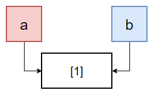

**들어가는 퀴즈**

Q. 각각 무엇이 출력 될까?

```jsx
let a = { value: 10 };
let b = a;

a.value = 5;

console.log(a.value);
console.log(b.value);
console.log([] === []);
```

정답은 각각 5, 5, false다. 헷갈리거나 틀렸다면 자바스크립트의 타입에 대한 개념을 정립해야 한다.

자바스크립트에서 타입(자료형)은 **저장 방식**에 따라 구분할 수 있다. 값 자체를 복사하는 **값 타입(Value Types)**과 레퍼런스를 복사하는 **참조 타입(Reference Types)**.

값 타입은 원시 타입과 매우 유사한데 `null`, `undefined`, `Number`, `String`, `Boolean` 그리고 새롭게 추가된 `symbol`이 이에 해당한다. 값 타입 변수에 다른 변수를 할당하면 그 변수의 값을 복사한다. 이를테면 아래 코드와 같이 동작한다.

```jsx
let a = 1;
let b = a;

a = 2;

console.log(a); // 2
console.log(b); // 1
```

보다시피 변수 `b`는 변수 `a`의 값 1을 복사해왔기 때문에 `a`의 값이 2로 변하더라도 `b`의 값은 그대로 1이다.

반면 참조 타입은 변수의 값이 아니라 그 변수가 가리키는 주소를 복사한다. 참조 타입으로는 `Object`가 있다. (자바스크립트에선 배열, 함수, 클래스 모두 객체에 포함된다.) 이를테면 아래 코드와 같이 동작한다.

```jsx
let a = [];
let b = a;

a.push(1);

console.log(a); // [1]
console.log(b); // [1]
console.log(a === b); // true
```

값 타입과 달리 변수 `b`에 `a`를 할당하고 나서 `a`의 값을 변화시켰는데 그 변화가 `b`에도 반영된 것을 확인할 수 있다. 이는 사실 `a`와 `b` 모두 메모리 상의 `[1]`이 저장된 같은 주소를 가리키고 있기 때문이다. 포인터의 개념을 알고 있다면 이해가 빠를 것이다.



❗**심화**

여기까지 이해하고 나면 이런 생각이 든다.

> "그러면 참조 타입을 복사하고 싶은데 주소가 아니라 값을 복사해오고 싶으면 어떡해?"

이러한 의문이 들었다면 **얕은 복사(shallow copy)**와 **깊은 복사(deep copy)**를 공부할 차례다. 조금만 덧붙이자면, 여기서 얕고 깊다는 것은 주소가 겉이고 그 안에 들어있는 값이 더 깊은 쪽이라고 생각하면 이해하기 쉽다. 예를 들어 다음과 같은 객체가 있다고 해보자.

`let obj = {a: 1, objInObj: {b: 2}};`

이 객체를 **얕은 복사**로 복사하게 된다면 프로퍼티 `a`까지는 값을 복사한다. 하지만 `objInObj`의 값은 복사하지 못한다. 주소를 복사하게 된다. 즉 복사하고자 하는 프로퍼티가 객체라면 주소로 복사하는 것이다. 자바스크립트에서 얕은 복사는 보통 `Object.assign()`을 이용한다.

`let newObj = Object.assign({}, obj);`

ES6에 추가된 전개 연산자(spread operator)를 이용한 얕은 복사도 가능하다.

`let newObj = [...obj];`

**깊은 복사**는 원본 객체를 완전히 복사하는 복사 방법이다. 대입 연산자나 얕은 복사처럼 주소를 공유하는 것이 아니라 새로운 메모리 공간을 확보하여 완전히 다른 새로운 복사본을 만들어낸다.

자바스크립트에서 깊은 복사는 보통 `JSON`방식을 통하여 구현한다.

`let newObj = JSON.parse(JSON.stringify(obj));`

하지만 이런 방법은 stringify → parse 과정을 거치기 때문에 성능적으로 떨어지고, JSON이 지원되지 않는 환경에서는 사용할 수도 없다. 이밖에도 관련 이슈들이 존재한다. 다른 방법으로는 `lodash` 라이브러리 등을 이용하는 게 있는데 일단 지금은 여기까지만 필요해지는 순간이 오면 공부하도록 하자.
