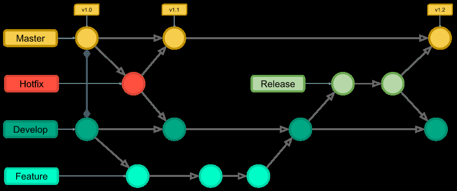

## Github를 이용한 블로그

정적 사이트 제너레이터를 이용하여 만들 계획

ctrl + shift + r : 캐시를 지우면서 새로고침

hexo + {username}.github.io repository로 정적 블로그를 만들 수 있다. → 마크다운 문서 작성에도 익숙해질 수 있음

포스트 작성 참고하기 좋은 우수 블로그 예시

- [http://tech.kakao.com/](http://tech.kakao.com/)
- [https://spoqa.github.io/](https://spoqa.github.io/)

1. 깃헙 아이디와 똑같은 레포 생성 후 로컬에 clone한다.
2. 테스트 파일을 만들고 add, commit, push한다.
3. 정적 사이트를 만들어주는 도구는 많지만 Node.js 기반의 블로그 생성기인 Hexo를 이용하도록 한다.
4. 포스트 작성법: `hexo new post "제목"`
5. 해당 md파일에 들어가 글을 작성한다.
   1. 마크다운 문법으로 포스트를 작성하고 `hexo generate`를 하면 html로 변환된다.
6. `hexo clear && hexo generate`
7. 배포 도구 설치, `npm install hexo-deployer-git --save`
8. config.yml에 들어가 url을 [https://유저명.github.io/](https://lazy-sky.github.io/) 로 변경한다.
9. deploy를 아래와 같이 수정한다.

```yaml
deploy:
	type: git
	repo: https://github.com/유저명/유저명.github.io.git
```

1. 배포, `hexo deploy`

### 분기점

git merge

conflict가 발생할 때 → 하나를 선택하거나 조합한 뒤 똑같이 add, commit (commit 메시지가 자동으로 입력되어 있음)

### gitignore

gitignore.io

깃이그노어 쓰는 방법

### 되돌리기 작업

함부로 파일을 이동하거나 이름을 바꾸면 추적이 안되는 문제가 생긴다. (히스토리 관점에서) 그래서 깃 명령어로 해주어야 한다.

- 이름 바꾸기: `git mv 원래이름 바꿀이름` (반드시 `git`을 써주어야 한다. 그렇지 않으면 파일이 삭제되었다가 다시 생성되는 방식이라 로그 추적을 할 수 없게 된다.)
- 최신 커밋의 시점으로 돌아오기, 변경사항 없애기: `git restore 파일명`
- git add 취소(unstage): `git reset HEAD 파일명`
- 최신 커밋 메시지: 수정 `git commit --amend`
- revert의 좋은 예시

  - 현재 HEAD에서 직전 3개의 commit을 순서대로 거슬러 올라가 해당 내역에 대해 commit, push 수행
  - `git revert --no-comit HEAD~3`
  - `git commit`
  - `git push origin 브랜치명`

    → 이렇게 하면 잘못하기 전 과거로 돌아가 최신을 유지하면서 되돌렸다는 이력을 commit으로 남겨 모든 팀원에게 이 사항을 공유하고 주지시킬 수 있다.

## Git flow

git flow는 브랜칭 모델의 한 종류로써 현업에서 가장 널리 쓰이고 있다. 각 단계가 명확히 구분된다는 장점이 있으나 다소 복잡하다. 대략적인 흐름은 다음과 같다.



### 초기화 및 시작

`git flow init`으로 레포지토리에서 git flow 사용을 시작할 수 있다.

### 새로운 기능 시작

`git flow feature start [브랜치명]`

### 기능완료

`git flow feature finish [브랜치명]`

### 릴리즈 시작

`git flow release start [버전명]`

### 릴리즈 완료

`git flow release finish [버전명]`

`git push --tags`

대략적인 커맨드는 다음과 같다.

![Git flow] 커맨드](../img/flowcommand.png)

## Github Issue & Projects

- Issue: 프로젝트, 레포지토리와 관계된 모든 해야할 일과 버그 및 개선사항 등을 기록
  - Assignees: 해당 이슈에 대한 책임 인원
  - Labels: 이슈의 종류
  - Projects: 이슈를 배당할 프로젝트
  - Milestone: 이슈에 해당하는 중요 시점 지정
- Projects: 해야할 일의 진도에 따른 구성과 우선순위 지정
